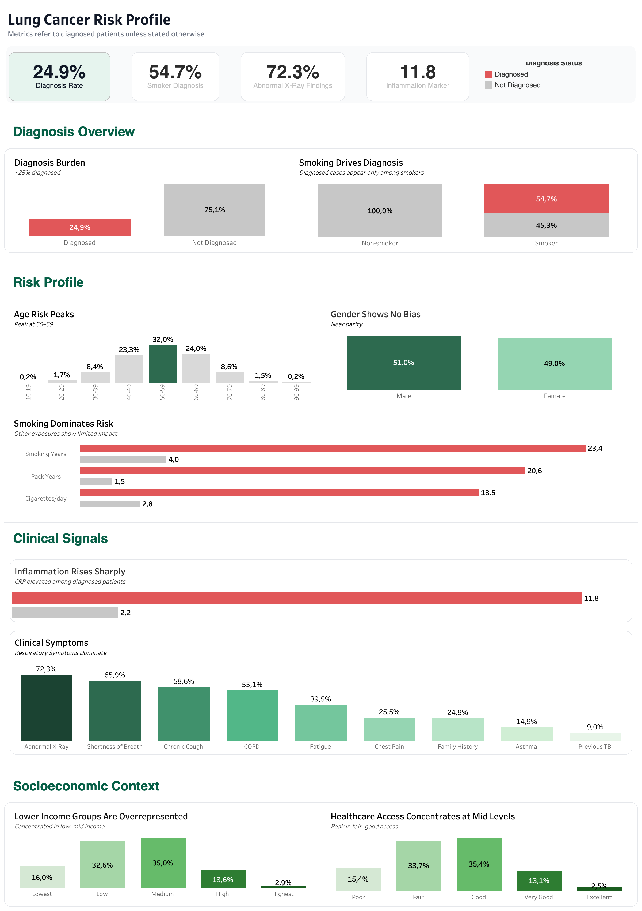

# Lung Cancer Risk Profile

## Overview

This project explores key factors associated with lung cancer diagnosis, combining demographic, lifestyle, environmental, and clinical data. 
The analysis focuses on identifying dominant risk drivers and understanding how they differ across patient groups.

## Dashboard

An interactive Tableau dashboard was developed to summarize key findings and highlight major risk patterns. The dashboard focuses on:
- diagnosis distribution and smoking impact
- demographic risk segmentation
- clinical symptom prevalence
- socioeconomic context of diagnosed patients

## Key Insights

- Smoking is the strongest risk factor, with substantially higher smoking intensity among diagnosed patients.
- Diagnosis prevalence peaks between ages 50–59, while gender distribution remains nearly balanced.
- Diagnosed patients show lower respiratory performance and substantially elevated inflammatory marker (CRP) levels.
- Abnormal X-ray findings, chronic cough, and COPD are the most prevalent clinical indicators.
- Lower-to-mid income groups are overrepresented among diagnosed patients.
- Occupational exposure and air pollution show limited association with diagnosis, while radon exposure shows a moderate increase in prevalence.

## Data Source

Dataset: https://www.kaggle.com/datasets/dhrubangtalukdar/lung-cancer-prediction-dataset

## Tools

- Python
- Pandas
- NumPy
- Matplotlib
- Seaborn
- Tableau

## Repository Structure

- `project_3.ipynb` - exploratory data analysis
- `plots/` - exported visualizations used in the analysis
- `data/` - raw and processed datasets used for analysis and visualization
- `tableau_dashboard_cancer_risk.twbx` - Tableau dashboard
- `dashboard_cancer_profile.png` - dashboard preview
- `README.md` - project documentation
- `requirements.txt` - Python dependencies